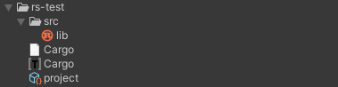
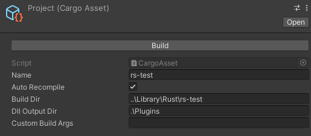

This is an experimental package that allows for you to create, manage, and compile cargo projects inside of the Unity editor.

# Features

- Cargo project creation via editor
- Cargo project compilation via a CargoAsset ScriptableObject, or via a `Build All` item
  - This item is located at `Tools/Nomnom/Rust/Build All`
- Basic rust hot-reloading
  - Toggled via `Tools/Nomnom/Rust/Hot reload`
- Rust DLL loading/unloading via a modified [NativePluginLoader](https://github.com/forrestthewoods/fts_unity_native_plugin_reloader)
- Example package located in the package samples
- `.rs` and `.toml` files can be viewed within the editor
  - Currently just readonly

# Creating a New Cargo Project



1. Create a new folder in the `Project` window with a name that follows typical cargo guidelines
2. Right-click the folder and create a new cargo project via `Create/Nomnom/Cargo Project`

# The Cargo Scriptable Object



- `Name`: the name used to name the output target folder and dll
- `Auto Recompile`: enables the use of recompiling this project when a rust file is modified within itself
- `Build Dir`: the directory that the `target` folder will be created in
  - Defaults to `..\Library\Rust\[Name]`, which is `[Unity Project Root]\Library\Rust\[Name]`
- `Dll Output Dir`: the directory to build the DLL into
  - Defaults to `.\Plugins` which is `[Unity Project Root]\Assets\Plugins`
- `Custom Build Args`: the arguments to insert onto the end of the build command
- `Build`: manually start a build of this cargo project

# Creating Rust/C# Bindings
Here is an eample of creating bindings between rust and C#.

Rust code:
```rust
#[no_mangle]
pub extern "C" fn add(a: i32, b: i32) -> i32 {
    a + b
}
```

C# code:
```csharp
using fts;

[PluginAttr("my-package-name")]
public static class MyPackageNameBindings {
  // check this before running a function to ensure that the
  // dll is actually loaded.
  public static bool IsAvailable = false; // required
  
  [PluginFunctionAttr("add")]
  public static Add add;
  public delegate int Add(int a, int b);
}
```

Usage:
```csharp
private void Start() {
    if (MyPackageNameBindings.IsAvailable) {
        int sum = MyPackageNameBindings.add(1, 2);
        Debug.Log(sum);
    }
}
```